# PHOLUS Framework

## Algorithmic Trading System | MT5 Expert Advisors

---

## Overview

**PHOLUS** is a sophisticated algorithmic trading framework built for MetaTrader 5, designed to automate trading strategies with precision, risk management, and scalability.

---

## System Architecture

---

## Trading Pipeline

---

## Smart Money Concepts Integration

---

## Multi-Timeframe Analysis

```mermaid
flowchart TB
    D1["📅 D1 - Daily<br/>Trend Direction"]
    H4["📊 H4 - 4 Hour<br/>Structure Confirmation"]
    H1["📈 H1 - 1 Hour<br/>Entry Zone ID"]
    M15["⚡ M15 - 15 Min<br/>Precision Entry"]

    D1 --> H4
    H4 --> H1
    H1 --> M15

    style D1 fill:#e3f2fd
    style H4 fill:#e8f5e9
    style H1 fill:#fff3e0
    style M15 fill:#fce4ec
```

---

## Risk Management System

```mermaid
flowchart LR
    subgraph PARAMS["Parameters"]
        RISK_PCT[Risk %<br/>1-2% per trade]
        MAX_DD[Max Drawdown<br/>5% daily]
        MAX_WEEK[Weekly Limit<br/>10% max]
    end

    subgraph CALC["Calculation"]
        BALANCE[Account Balance]
        ATR[ATR Value]
        SL_DIST[Stop Distance]
    end

    subgraph OUTPUT["Position Size"]
        LOT[Lot Size]
        FORMULA["Lot = Risk% × Balance<br/>÷ SL × Pip Value"]
    end

    RISK_PCT --> FORMULA
    BALANCE --> FORMULA
    ATR --> SL_DIST --> FORMULA
    FORMULA --> LOT

    style PARAMS fill:#ffebee
    style CALC fill:#e3f2fd
    style OUTPUT fill:#e8f5e9
```

| Parameter | Value | Purpose |
|-----------|-------|---------|
| **Max Risk/Trade** | 1-2% | Capital protection |
| **Daily Drawdown** | 5% | Daily limit |
| **Weekly Drawdown** | 10% | Weekly limit |
| **Position Sizing** | ATR-Based | Dynamic lots |

---

## Performance Features

---

## Integration Capabilities

---

## Technology Stack

| Component | Technology | Purpose |
|-----------|------------|---------|
| **Core Language** | MQL5 | Expert Advisor development |
| **Platform** | MetaTrader 5 | Trading execution |
| **Analysis** | Custom Algorithms | Market structure detection |
| **Risk Engine** | Proprietary | Capital protection |
| **Integration** | Python Bridge | External connectivity |

---

## Development Standards

---

## Use Cases

| Scenario | Application |
|----------|-------------|
| **Day Trading** | Automated 24/5 execution |
| **Scalping** | High-frequency with tight risk |
| **Swing Trading** | Multi-day position management |
| **Portfolio** | Multi-asset allocation |
| **Signals** | Alert generation for manual traders |

---

## Deliverables

| Item | Description |
|------|-------------|
| **Compiled EA** | Ready-to-deploy .ex5 file |
| **Documentation** | Technical specs & user guide |
| **Configuration** | Customizable parameters |
| **Support** | Post-deployment assistance |

---

## Capabilities Demonstrated

- **MQL5 Development** - Native MetaTrader 5 programming
- **Algorithmic Trading** - Automated strategy execution
- **Risk Management** - Institutional-grade capital protection
- **Technical Analysis** - Smart Money Concepts implementation
- **System Architecture** - Modular, scalable design
- **Real-Time Processing** - Millisecond execution latency

---

**Technologies:** MQL5 | MetaTrader 5 | Algorithmic Trading | Python Integration | API Development

**Category:** Trading Systems | Financial Software | Automation

---

*This project demonstrates capability to build complex, production-ready trading systems with institutional-grade risk management.*
